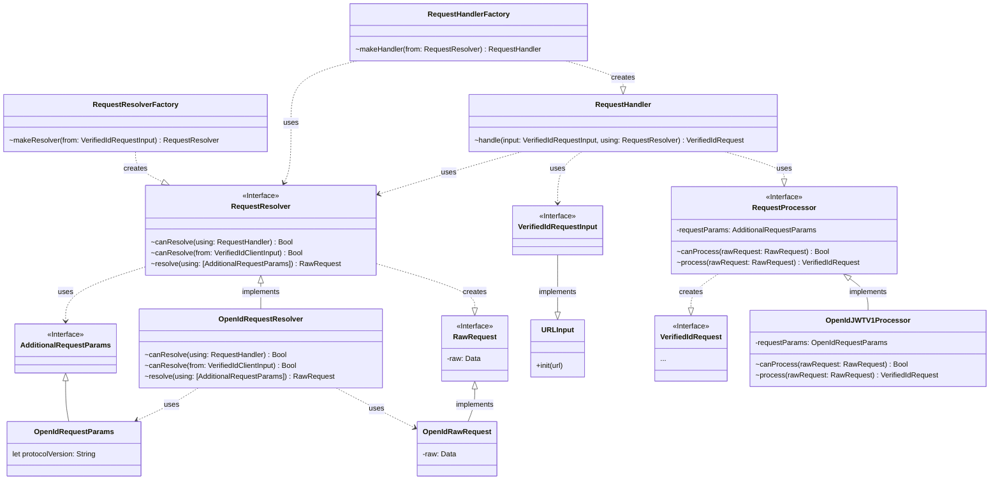

# Library External Architecture
## Request Handlers

```mermaid
classDiagram
RequestResolverFactory ..|> RequestResolver: creates
RequestResolver ..> AdditionalRequestParams: uses
RequestResolver <|-- OpenIdRequestResolver: implements
RequestResolver ..|> RawRequest: creates
OpenIdRequestResolver ..> OpenIdRawRequest: uses
RawRequest <|-- OpenIdRawRequest: implements
AdditionalRequestParams <|-- OpenIdRequestParams
OpenIdRequestResolver ..> OpenIdRequestParams: uses
RequestHandlerFactory ..|> RequestHandler: creates
RequestHandlerFactory ..> RequestResolver: uses
RequestHandler ..> RequestResolver: uses
RequestHandler ..> VerifiedIdRequestInput: uses
VerifiedIdRequestInput --|> URLInput: implements
RequestHandler ..|> RequestProcessor: uses
RequestProcessor ..|> VerifiedIdRequest: creates
RequestProcessor <|-- OpenIdJWTV1Processor: implements
class RequestResolverFactory{
    ~makeResolver(from: VerifiedIdRequestInput) RequestResolver
}
<<Interface>> RequestResolver
class RequestResolver {
    ~canResolve(using: RequestHandler) Bool
    ~canResolve(from: VerifiedIdClientInput) Bool
    ~resolve(using: [AdditionalRequestParams]) RawRequest
}
class OpenIdRequestResolver {
    ~canResolve(using: RequestHandler) Bool
    ~canResolve(from: VerifiedIdClientInput) Bool
    ~resolve(using: [AdditionalRequestParams]) RawRequest

}
class RequestHandlerFactory{
    ~makeHandler(from: RequestResolver) RequestHandler
}
class RequestHandler{
    ~handle(input: VerifiedIdRequestInput, using: RequestResolver) VerifiedIdRequest
}
<<Interface>> VerifiedIdRequestInput
class URLInput{
    +init(url)
}
<<Interface>> RequestProcessor
class RequestProcessor {
    -requestParams: AdditionalRequestParams
    ~canProcess(rawRequest: RawRequest) Bool
    ~process(rawRequest: RawRequest) VerifiedIdRequest
}
class OpenIdJWTV1Processor {
    -requestParams: OpenIdRequestParams
    ~canProcess(rawRequest: RawRequest) Bool
    ~process(rawRequest: RawRequest) VerifiedIdRequest
}
class OpenIdRequestParams {
    let protocolVersion: String
}
<<Interface>> AdditionalRequestParams
<<Interface>> RawRequest
class RawRequest {
    -raw: Data
}
class OpenIdRawRequest {
    -raw: Data
}
<<Interface>> VerifiedIdRequest
class VerifiedIdRequest {
    ...
}
```
