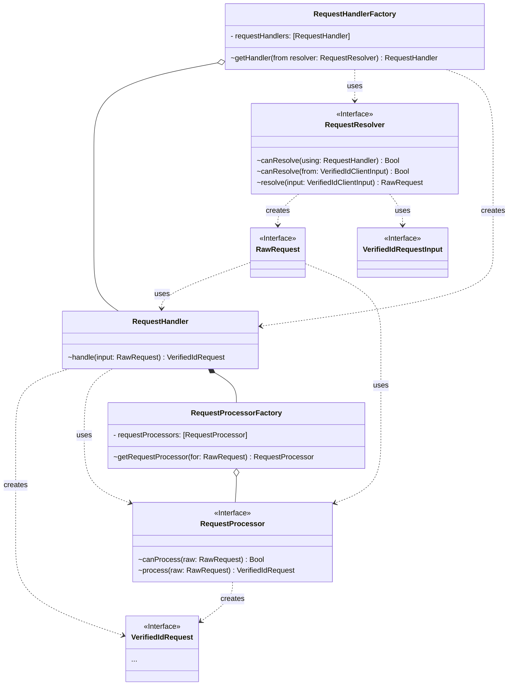
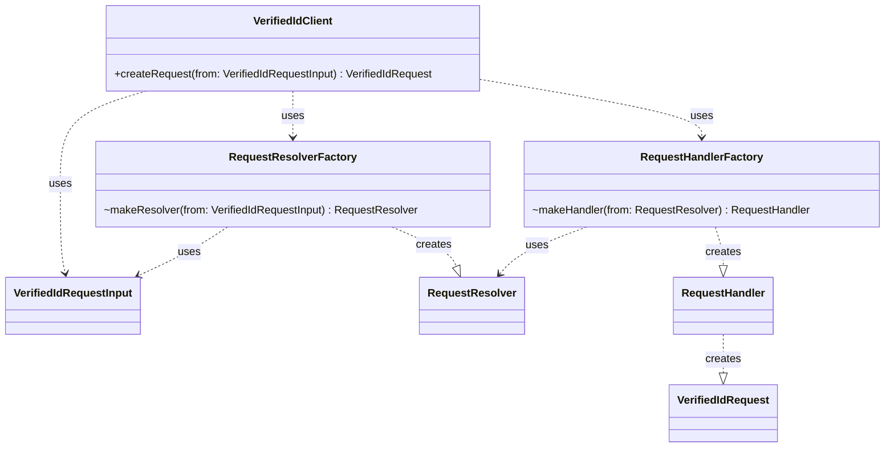

# Library Internal Architecture

## Creating a Verified Id Request from Input

## Concepts

### Request Resolver
A Request Resolver resolves a raw request from a request input and additional params. A request resolver is specific to a certain type of request handler and input type. 

Ex: An `OpenIdURLRequestResolver` would know how to resolve a raw open id request token. The additional params would be OpenId specific to be used to send any additional information needed to resolve the request (what version of openid is supported, for example). The result would be a `OpenIdRawRequest` that has not been processed or validated yet.

### Request Handler
A request handler is used to handle an input where the request can be resolved by a request resolver and then processed, validated and mapped to a Verified Id Request. A request handler is protocol specific (e.g. `OpenIdRequestHandler`). It does not need to know to resolve the input as that logic is handles by the resolver.

Ex: An `OpenIdRequestHandler` would take in any type of input as long as the resolver that is also passed in knows how to resolve the input into an OpenIdRawRequest. The `OpenIdRequestHandler` would contain a list of `OpenIdRequestProcessors` that know how to process different types of openid version or extensions (e.g. jwt 0.1, jwt 0.2, json-ld, etc). `OpenIdRequestHandler` can parse the base OpenID request, then use `OpenIDRequestProcessors` for verified ID logic to form responses, then serialize and send the response according to openID protocol.

### Request Processor
A request processor is used to process a Raw Request and return a Verified Id Request. A request processor is protocol-version specific logic.

Ex. A `JWTV1RequestProcessor` takes in a `OpenIdRawRequest` and processes, validates, and maps it to a Verified Id Request.

## Configuring the Request Handler
