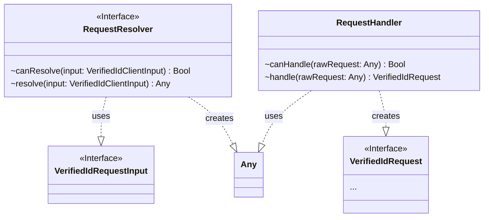
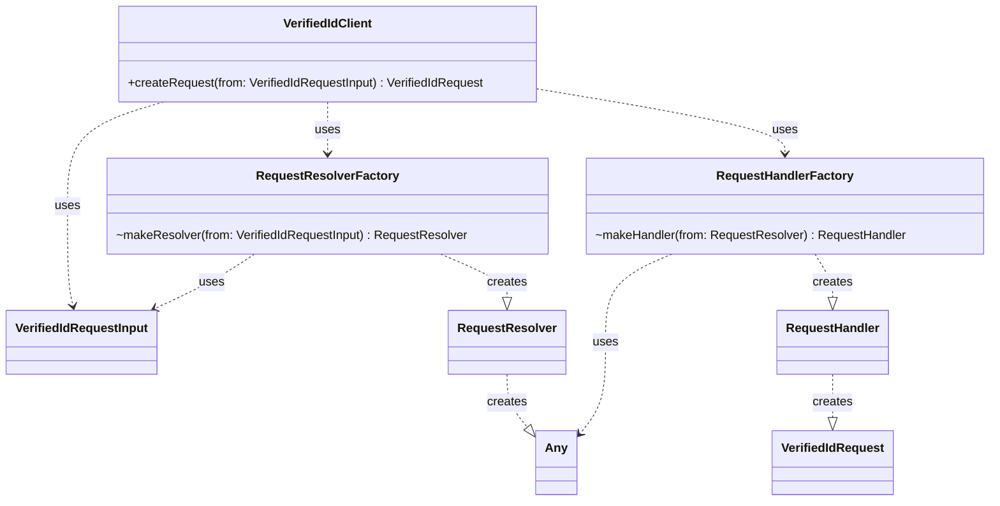

# Library Internal Architecture

## Creating a Verified Id Request from Input

## Concepts

### Request Resolver
A Request Resolver resolves a raw request from a request input. A request resolver is specific to a certain type of protocol and input type. 

Ex: An `OpenIdURLRequestResolver` would know how to resolve a raw open id request token.

### Request Handler
A request handler is used to process, validate and map it to a Verified Id Request. A request handler is protocol specific (e.g. `OpenIdRequestHandler`). 

### Request Processor
TODO 

## Configuring the Request Handler
