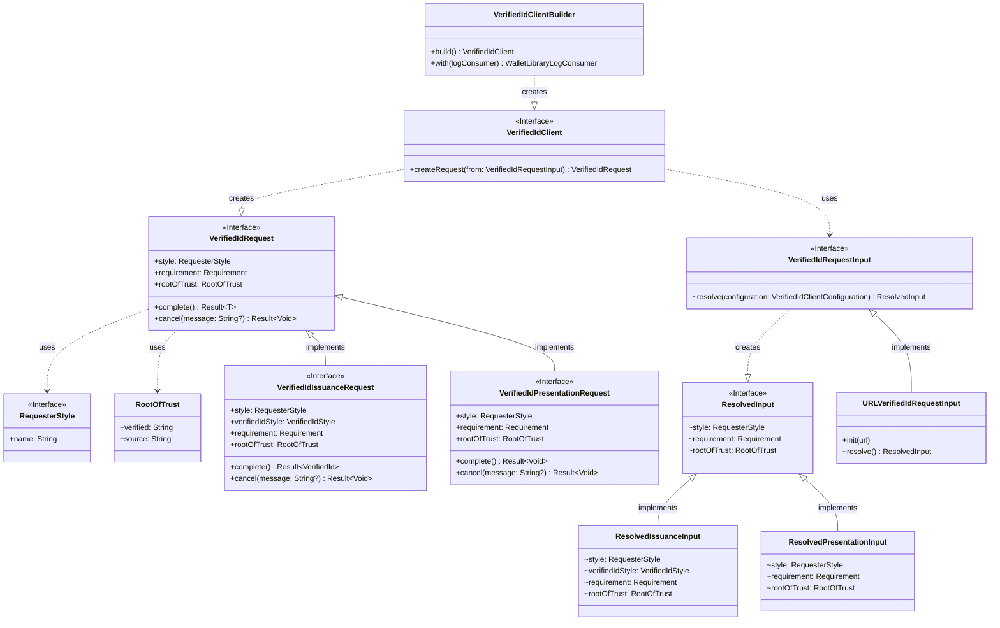
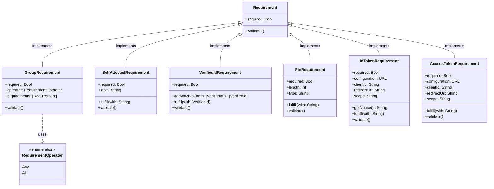
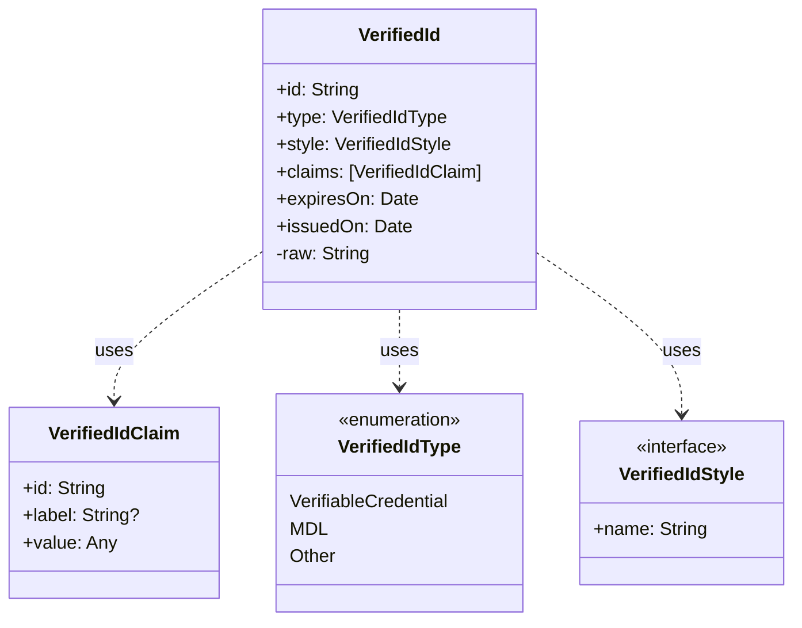

# Library Architecture
## Verified Id Client

```mermaid
classDiagram
VerifiedIdClientBuilder ..|> VerifiedIdClient: creates
VerifiedIdClient ..|> VerifiedIdRequest: creates
VerifiedIdRequest ..> RequesterStyle: uses
VerifiedIdRequest ..> RootOfTrust: uses
VerifiedIdRequest <|-- VerifiedIdIssuanceRequest: implements
VerifiedIdRequest <|-- VerifiedIdPresentationRequest: implements
VerifiedIdClient ..> VerifiedIdRequestInput: uses
VerifiedIdRequestInput ..|> ResolvedInput: creates
ResolvedInput <|-- ResolvedIssuanceInput: implements
ResolvedInput <|-- ResolvedPresentationInput: implements
VerifiedIdRequestInput <|-- URLVerifiedIdRequestInput: implements
class VerifiedIdClientBuilder{
    +build() VerifiedIdClient
    +with(logConsumer) WalletLibraryLogConsumer
}
<<Interface>> VerifiedIdClient
class VerifiedIdClient{
    +createRequest(from: VerifiedIdRequestInput) VerifiedIdRequest
}
<<Interface>> VerifiedIdRequestInput
class VerifiedIdRequestInput{
    ~resolve(configuration: VerifiedIdClientConfiguration) ResolvedInput
}
class URLVerifiedIdRequestInput{
    +init(url)
    ~resolve() ResolvedInput
}
<<Interface>> VerifiedIdRequest
class VerifiedIdRequest{
    +style: RequesterStyle
    +requirement: Requirement
    +rootOfTrust: RootOfTrust
    +complete() Result<<T>T>
    +cancel(message: String?) Result<<T>Void>
}
<<Interface>> VerifiedIdIssuanceRequest
class VerifiedIdIssuanceRequest{
    +style: RequesterStyle
    +verifiedIdStyle: VerifiedIdStyle
    +requirement: Requirement
    +rootOfTrust: RootOfTrust
    +complete() Result<<T>VerifiedId>
    +cancel(message: String?) Result<<T>Void>
}
<<Interface>> VerifiedIdPresentationRequest
class VerifiedIdPresentationRequest{
    +style: RequesterStyle
    +requirement: Requirement
    +rootOfTrust: RootOfTrust
    +complete() Result<<T>Void>
    +cancel(message: String?) Result<<T>Void>
}
<<Interface>> ResolvedInput
class ResolvedInput{
    ~style: RequesterStyle
    ~requirement: Requirement
    ~rootOfTrust: RootOfTrust
}
class ResolvedIssuanceInput{
    ~style: RequesterStyle
    ~verifiedIdStyle: VerifiedIdStyle
    ~requirement: Requirement
    ~rootOfTrust: RootOfTrust
}
class ResolvedPresentationInput{
    ~style: RequesterStyle
    ~requirement: Requirement
    ~rootOfTrust: RootOfTrust
}
class RootOfTrust{
    +verified: String
    +source: String
}
<<Interface>> RequesterStyle
class RequesterStyle{
    +name: String
}
```

## Requirements

```mermaid
classDiagram
GroupRequirement ..> RequirementOperator: uses
Requirement <|-- GroupRequirement: implements
Requirement <|-- SelfAttestedRequirement: implements
Requirement <|-- VerifiedIdRequirement: implements
Requirement <|-- PinRequirement: implements
Requirement <|-- IdTokenRequirement: implements
Requirement <|-- AccessTokenRequirement: implements
class Requirement {
    +required: Bool
    +validate()
}
class GroupRequirement {
    +required: Bool
    +operator: RequirementOperator
    +requirements: [Requirement]
    +validate()
}
<<enumeration>> RequirementOperator
class RequirementOperator {
    Any
    All 
}
class SelfAttestedRequirement {
    +required: Bool
    +label: String
    +fulfill(with: String)
    +validate()
}
class VerifiedIdRequirement {
    +required: Bool
    +getMatches(from: [VerifiedId]) [VerifiedId]
    +fulfill(with: VerifiedId)
    +validate()
}
class PinRequirement {
    +required: Bool
    +length: Int
    +type: String
    +fulfill(with: String)
    +validate()
}
class IdTokenRequirement {
    +required: Bool
    +configuration: URL
    +clientId: String
    +redirectUri: String
    +scope: String
    +getNonce() String
    +fulfill(with: String)
    +validate()
}
class AccessTokenRequirement {
    +required: Bool
    +configuration: URL
    +clientId: String
    +redirectUri: String
    +scope: String
    +fulfill(with: String)
    +validate()
}
```

## Verified Id

```mermaid
classDiagram
VerifiedId ..> VerifiedIdClaim: uses
VerifiedId ..> VerifiedIdType: uses
VerifiedId ..> VerifiedIdStyle: uses
class VerifiedId {
    +id: String
    +type: VerifiedIdType
    +style: VerifiedIdStyle
    +claims: [VerifiedIdClaim]
    +expiresOn: Date
    +issuedOn: Date
    -raw: String
}

<<enumeration>> VerifiedIdType
class VerifiedIdType {
    VerifiableCredential
    MDL
    Other
}

<<interface>> VerifiedIdStyle
class VerifiedIdStyle {
    +name: String
}

class VerifiedIdClaim {
    +id: String
    +label: String?
    +value: Any
}
```

