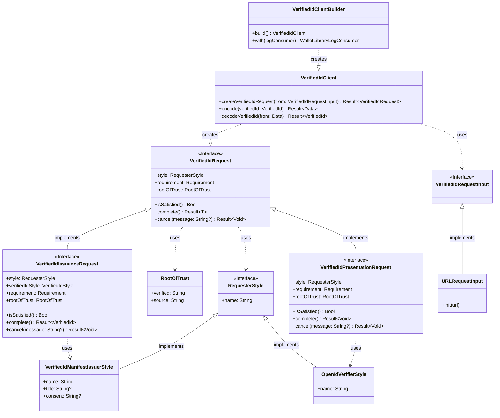
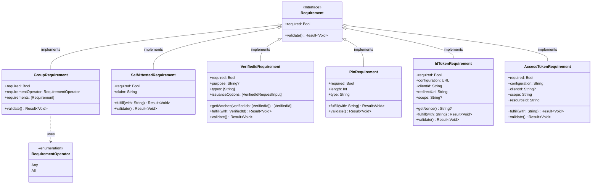
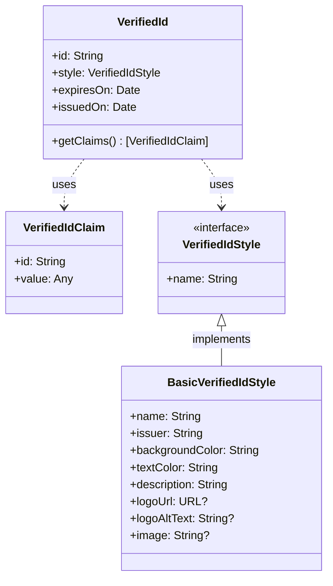

# Library External Architecture
## Verified Id Client
The Verified Id Client is the main entry point into the library. The client can be configured with optional settings using the Verified Id Client Builder. The client can be used to create Verified Id Requests during an issuance or presentation flow.

## Requirements
A Requirement is an object that describes a necessary piece of information to be included to complete a Verified Id Request.

## Verified Id
A Verified Id is an abstract representation of a piece of verifiable information. For example, a Verifiable Credential is one type of Verified Id.

