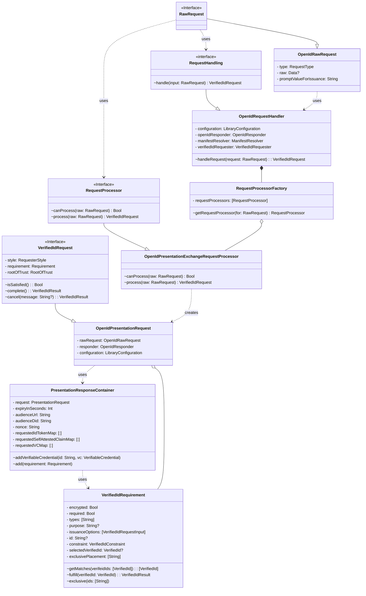

# OpenID Presentation Exchange Request Processor
[Presentation Exchange](https://identity.foundation/presentation-exchange/) is a data format defining the exchange of credentials. Combined with the [OpenID Connect Verifiable Presentations](https://openid.net/specs/openid-4-verifiable-presentations-1_0.html) extension creates a complete verified id request and response flow.

`OpenIdPresentationExchangeRequestProcessor` can be called by `OpenIdRequestHandler` with the request. If the request is an `OpenIdRawRequest`, the processor will parse the `raw` value for a definition and form the corresponding `VerifiedIdRequest`.

In parsing, it converts `input_definition`s into `VerifiedIdRequirement`s. `VerifiedIdRequirement` is fulfilled by supplying a `VerifiedId` that matches constraints.

Once all `VerifiedIdRequirement`s have been satisfied, the OpenIdPresentationRequest can `complete()`. This will create a `PresentationResponseContainer` and `add` each requirement to the container. Once added, the container can be serialized, signed, and send according to the request's parameters.

**Proposed Change**: `exclusivePlacement` can be added to `VerifiedIdRequirement` with `exclusive(with: [definition_id])` to ensure input definitions / requirements do not share the same verifiable presentation. `PresentationResponseContainer` will note these exclusions and any subject conflicts to create and map as many verifiable presentations as required.